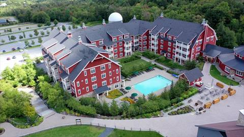
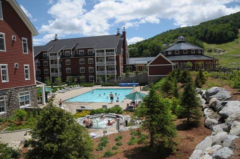
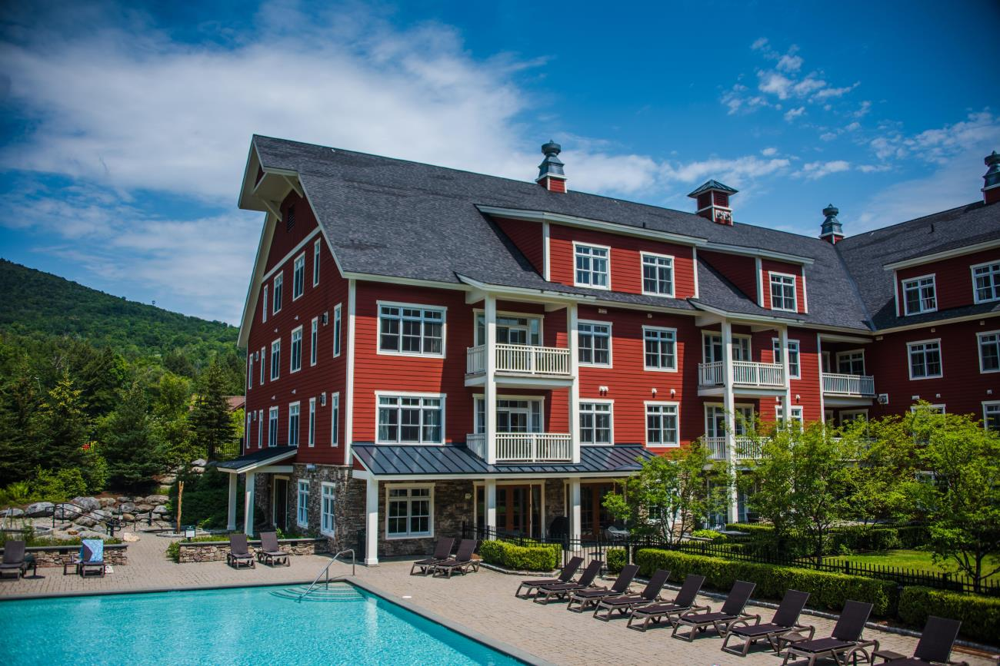

# CIS 5660 HW04 Procedural Buildings

## Project Planning

For this project I want to recreate the style of the Sugarbush Resort in Warren VT.

These reference images are courtesy of the sugarbush website:

I envision the procedural process of building this being:

1.  Define a base layout using lines , whether fully procedural or art directable.
2. Segment the layout into 2 types, either the more barn like type you can see on the right of the first image, or the more standard sloped building you see on the left of the first image.
3. Give the layout thickness depending on the segmented type.
4. Build up floors, with the bottom one being stone and wood otherwise.
5. Add first floor overhang with support columns.
6. Adding balconies with support beams.
7. Use booleans or other methods for creating roofs.

### Assets
I will need assets for windows with 2 and 3 panels, fenced balconies, doors, and a roof at a base level.

## Building Process

I first started by implementing the box stacking from the tutorial:

After this I made assets for the windows, door, and balcony in blender, and scattered them over the floors:

Next, I added pillars and borders on the floors:

Then I followed the tutorial's guidelines on adding support beams:

Since my reference had a roof, I decided to augment slightly by adding a new subnetwork after my for loop over the floors which added a roof that is the same scale as the last floor. I did this by splitting the box by normals, and used attribute wrangles to do the transformations I wanted. Finally I extruded the plane to make the roof thicker.

In action, the tool looks like this:

https://github.com/user-attachments/assets/c134c555-1ead-46b8-b19a-2bf83d2adaec

I'll also note that the inspiration has quite a few less features than in the video (namely that floors are not random and are also uniformly sized), but I am including everything here for demonstration purposes.
